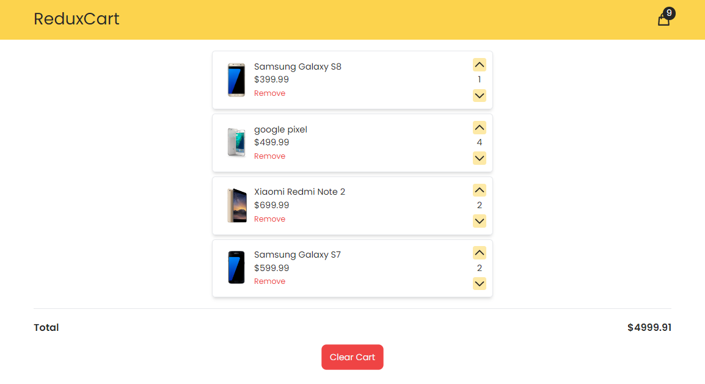

  
  <h1>Redux Products</h1>
  

    A simple Redux app to add products to the cart. The main purpose of making this app was to use Redux. In this app you can increase or decrease the amount of a product and the product will be deleted if the amount is equal to 0.
  

  

    I made this app based on <a href="https://www.youtube.com/channel/UCMZFwxv5l-XtKi693qMJptA">Coding addict</a> tutorial.
  

  

    Edit the codes and let me know if you have more knowledge or better ideas.
  

  
In the project directory, you can run:

  <pre>npm start</pre>
  

    It runs the app in the development mode. Open
    <a href="http://localhost:3000">http://localhost:3000</a> to view it in the
    browser.
  

  

    The page will reload if you make edits. You will also see any lint errors in
    the console.
  

